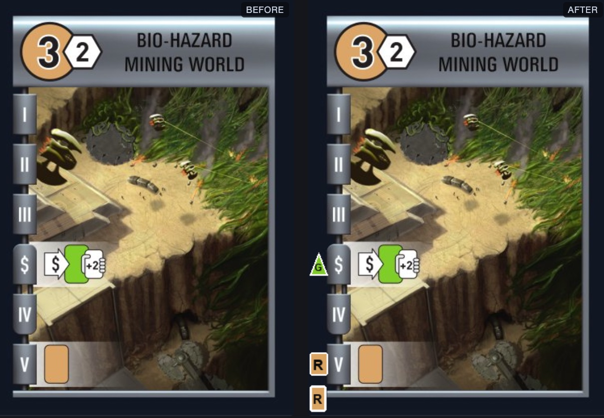

# Color-blind accessible card art for Race for the Galaxy

This repository adds two tools that make Race for the Galaxy's card art readable without relying on color vision.
Nothing in the game's source, and nothing in the shipped `images.data` bundle, is modified.




## Upstream

The game itself is Keldon Jones' Race for the Galaxy AI, version 0.9.4.
Source code, the Windows installer and a pre-compiled macOS binary all come from the project page at <https://www.keldon.net/rftg/>.
For the upstream build and gameplay documentation, see [`README`](README) alongside this file.

Race for the Galaxy was designed by Tom Lehmann and published by Rio Grande Games, who hold the copyright on the card images and names.
The upstream page notes that they granted permission to distribute those images with this program but that they may not be redistributed or used for any other purpose.
The tools here derive new images from that artwork, so the same restriction applies to whatever they produce — keep the generated `image/` directory local rather than republishing it.

## The fix

Every good reference gets a marker combining a distinct silhouette with a letter, so the meaning survives with color removed entirely:

| good | letter | shape |
| --- | --- | --- |
| Novelty | N | circle |
| Rare | R | square |
| Genes | G | triangle |
| Alien | A | diamond |

Markers go in two places, both of which are plain dark border on all 236 cards: the narrow gutter down the left edge, beside whichever phase band references the good, and the bottom-left corner for the world's own good.
No existing artwork is covered.

The shapes are what matter at table scale.
Letters stay legible down to roughly 250 px card width, but the silhouettes remain distinguishable at 150 px, which is about as small as the game ever draws a card.

## Why this does not touch the source data

`gui.c` already looks for loose image files before falling back to the bundle:

```c
char *dirs[] = { RFTGDIR "/image/", "image/", "", NULL };
```

`load_one_image` tries each in turn and takes the first hit, and `load_image_bundle` runs afterwards filling only the slots still empty.
So a file dropped into `image/` wins over `images.data` with no code change.

Only the 133 cards that need at least one marker are written.
The other 103 keep loading straight from the bundle and are never re-encoded, so they are bit-identical to the original.
Deleting `image/` reverts everything.

## Requirements

Python 3 and [Pillow](https://python-pillow.org/).
Nothing else; the tools are two standalone files and do not participate in the autotools build.

```sh
python3 -m pip install Pillow
```

## Generating the images

Run from the project root:

```sh
python3 tools/colorblind_cards.py
```

This reads `cards.txt` and `images.data`, works out which goods each card references from its `G:` and `P:` lines, and writes the marked cards to `image/`:

```
wrote 133 card(s) carrying 223 marker(s) to image/ (103 card(s) left to images.data)
```

Useful flags:

- `--dry-run` runs every safety check and reports what would happen, writing nothing.
- `--quality N` sets JPEG quality (default 95, always 4:4:4 subsampling so the markers do not pick up chroma smearing).
- `--out DIR`, `--cards PATH`, `--bundle PATH` override the default locations.

### What the safety checks guarantee

The script refuses to write if any marker would land on artwork.
Each target region must be dark border, measured as mean brightness below 60, and must contain essentially no saturated pixels, defined as brighter than 110 with a channel spread above 45.
Legitimate regions contain zero such pixels.

That second check exists because of a real near-miss.
Cards from the Brink of War expansion carry a small colored square at `(24,496)-(28,501)` marking the expansion set.
An earlier, wider corner region overlapped it, and a plain brightness average did not notice because 28 stray pixels barely move the mean of a 1600-pixel box.
The corner region now stops at x=22 and the saturation check catches that class of collision if it ever recurs.

Re-encoding accuracy outside the marker regions is 50.2 dB PSNR on average and 47.0 dB at worst, with a maximum single-pixel deviation of 11 out of 255 — visually lossless.

## Reviewing the result

```sh
python3 tools/compare_cards.py
```

This writes `card-comparison.html`, a single self-contained page pairing each patched card with its bundled original.
Open it in any browser; no server or build step is involved.
It offers side-by-side and hover-swap comparison, a width slider covering the range the game actually renders at, filtering by good type, search by card name or index, and a per-card report of the marker layout and the re-encode accuracy.

Flags:

- `--with-vision` adds a picker that applies deuteranopia, protanopia and tritanopia simulation to the card images live, using the same Viénot projections as the analysis above compiled into SVG color matrices.
  Without the flag the filters are still in the page and reachable by loading it with a `#deutan`, `#protan` or `#tritan` fragment.
- `--only INDEX...` restricts the page to specific cards, which is much faster when spot-checking.
  `--only 87` jumps straight to Bio-Hazard Mining World.

Note that the simulation reproduces which colors become indistinguishable, not what a color-blind person subjectively sees.
It is a projection, so applying it to an already-simulated image changes nothing; that is precisely the property it guarantees.

## Installing

Where the files go depends on how you run the game.
All three targets follow from the search order quoted earlier.

### Into a macOS `.app` bundle

This is the easiest route, and it needs no compiler: the upstream page ships a pre-compiled `RFTG.app` for 0.9.4 that no longer depends on the old GTK framework, so you can drop the images straight into it.

On Apple platforms `main()` changes the working directory to the bundle's resource directory before any image is loaded, so `image/` always resolves inside the bundle and a copy sitting in your source tree is unreachable.
Copy it in:

```sh
cp -R image "/path/to/RFTG.app/Contents/Resources/"
```

Two things to know.
Modifying a bundle invalidates its code signature; if the app was signed and macOS starts refusing to launch it, re-sign ad-hoc with `codesign --force --deep --sign - /path/to/RFTG.app`.
And replacing or rebuilding the app discards the copy, so this step has to be repeated.

### Into an installed build

`RFTGDIR` is the first candidate and is compiled in as `$(pkgdatadir)`, `/usr/local/share/rftg` by default.
Installing there makes the images work from any working directory:

```sh
sudo cp -R image /usr/local/share/rftg/
```

Note that `make install` will not do this for you.
`Makefile.am` installs only `cards.txt`, `campaign.txt` and `images.data`.

### Running from the source tree

The second candidate is relative to the working directory, so launching the way the upstream `README` describes needs no extra step — `image/` is already in the right place:

```sh
cd /path/to/rftg && ./rftg
```

On macOS this works for a different reason than it looks: an unbundled binary still goes through the same `chdir`, and there the resource directory resolves to the directory holding the executable, which for an in-tree build is the project root.

## Reverting

```sh
rm -rf image/
```

Or delete `Contents/Resources/image/` from the bundle.
Every card then loads from `images.data` exactly as before.

## Files

| path | role |
| --- | --- |
| `tools/colorblind_cards.py` | generates the marked card images |
| `tools/compare_cards.py` | builds the HTML review page |
| `image/` | generated output, 133 card faces |
| `card-comparison.html` | generated review page |

Both generated artifacts are reproducible from the two scripts and are good candidates for `.gitignore`.
`tools/compare_cards.py` imports the card parsing, bundle reading and marker geometry from `tools/colorblind_cards.py`, so the two cannot disagree about where a marker belongs.
